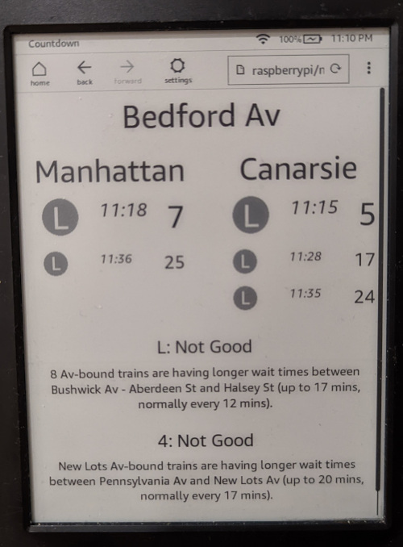

# MTA Kindle Countdown Timer

Uses the MTA App API and [goodservice.io](https://www.goodservice.io) to display
a station countdown timer and any alerts in a kindle-friendly interface.

## Setup

### Populating API KEY
1. Create an API key at https://api.mta.info
2. Create a `.env` file in repo root, with `API_KEY="<YOUR_API_KEY>"`

### Building

* Run `cargo build --release`

## Usage
1. Run `./target/release/mta`
2. Visit http://localhost:8080

### Options
Right now the site only supports 1 station and up to 2 line alerts.
The default is Bedford Ave (L08), watching the L and 4.

To modify, visit e.g. http://localhost:8080#A32&F.
This monitors W 4th St, and the A and F.

The full station list is available from the MTA [here](https://atisdata.s3.amazonaws.com/Station/Stations.csv).
